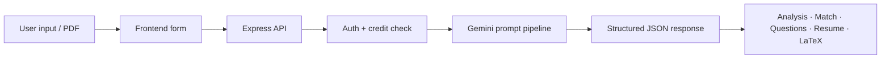
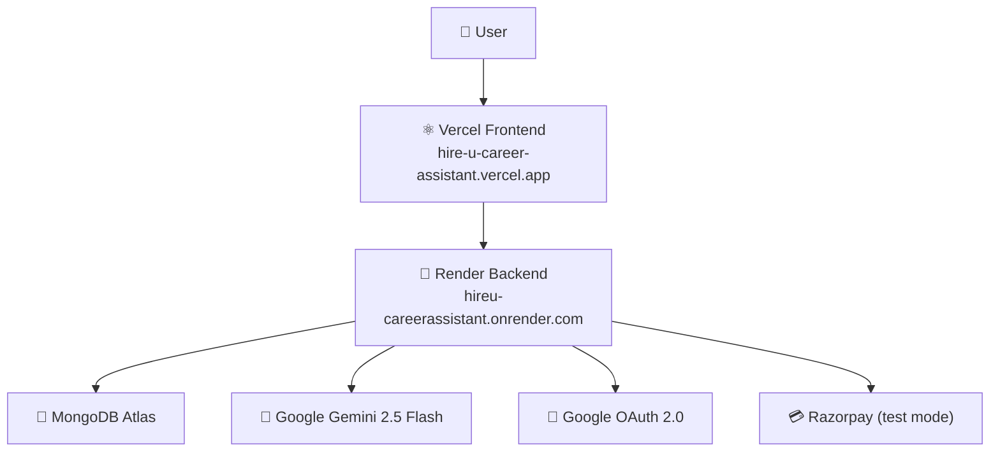

<div align="center">

# 🎓 HireU — AI Career Assistant

**Resume analysis · Job matching · Interview prep · Resume builder**  
From PDF to polished LaTeX resume — powered by Gemini AI.

[](https://hire-u-career-assistant.vercel.app)
[](https://hireu-careerassistant.onrender.com)
[](https://react.dev)
[](https://www.typescriptlang.org)
[](https://www.mongodb.com/atlas)

**→ [hire-u-career-assistant.vercel.app](https://hire-u-career-assistant.vercel.app)**

</div>

---

## What is HireU?

HireU is a full-stack AI career assistant that walks users through the entire job preparation workflow in one place — upload a resume, get a detailed ATS analysis, match it against relevant roles, generate interview questions tailored to the position, and rebuild the resume with AI suggestions. Everything exports cleanly to LaTeX for Overleaf.

> **Demo & screenshots** — _coming soon_

---

## Features

| # | Feature | Description |
|---|---------|-------------|
| 📄 | **Resume Analyser** | Upload a PDF resume and receive a structured ATS score, skill gaps, and improvement suggestions powered by Gemini 2.5 Flash. |
| 🎯 | **Job Matcher** | Compare your resume or skill set against real career roles; get ranked match scores and tailored advice. |
| 🎙️ | **Interview Prep** | Generate role-specific and round-specific interview questions with expected answer frameworks. |
| 🧱 | **Resume Builder** | Describe your experience, get AI-enhanced bullet points, and iterate on a polished resume interactively. |
| 📜 | **LaTeX Export** | One-click export to a clean IIT-style LaTeX template, ready to compile on Overleaf or locally. |
| 🔐 | **Google OAuth** | Secure sign-in via Google with JWT session management. |
| 🪙 | **Credit System** | 10 free requests on signup. Top up with paid credit packs via Razorpay (test mode; live payments coming soon). |

<details>
<summary><strong>🧠 AI request pipeline</strong></summary>



</details>

---

## Architecture



> **Note:** The Render free tier spins down after inactivity. The first request after a cold start may take 10–30 seconds.

---

## Tech Stack

| Layer | Technology |
|-------|-----------|
| Frontend | React 19, TypeScript, Vite, Tailwind CSS v4 |
| Routing | React Router v7 |
| HTTP client | Axios |
| Auth | Google OAuth 2.0, JWT |
| Backend | Node.js, Express 5, TypeScript |
| Database | MongoDB Atlas, Mongoose |
| AI | Google Gemini 2.5 Flash via `@google/genai` |
| Payments | Razorpay (test mode) |
| Deployment | Vercel (frontend), Render (backend) |

---

## Project Structure

```
HireU/
├── backend/
│   ├── src/
│   │   ├── config/          # DB connection, Google OAuth, Gemini prompts
│   │   ├── controllers/     # ai.ts, payment.ts, review.ts, user.ts
│   │   ├── middlewares/     # isAuth.ts, trycatch.ts
│   │   ├── models/          # User.ts, Review.ts
│   │   ├── routes/          # ai, payment, review, user
│   │   ├── services/        # latexGenerator.ts
│   │   └── index.ts
│   ├── .env.example
│   ├── package.json
│   └── tsconfig.json
│
├── frontend/
│   ├── src/
│   │   ├── components/
│   │   ├── context/
│   │   ├── pages/
│   │   ├── App.tsx
│   │   └── main.tsx
│   ├── public/
│   ├── .env.example
│   ├── vercel.json
│   └── vite.config.ts
│
├── render.yaml
└── README.md
```

---

## Local Setup

### Prerequisites

- Node.js 20+
- MongoDB URI (Atlas or local)
- Google Cloud OAuth 2.0 credentials
- Gemini API key from [Google AI Studio](https://aistudio.google.com)
- Razorpay test keys (optional, only needed if testing payment flow)

### Backend

```bash
cd backend
cp .env.example .env   # fill in your values
npm install
npm run dev            # runs on http://localhost:5000
```

`backend/.env`

```env
PORT=5000
FRONTEND_URL=http://localhost:5173
MONGO_URI=your_mongodb_connection_string
GOOGLE_CLIENT_ID=your_google_client_id
GOOGLE_CLIENT_SECRET=your_google_client_secret
API_KEY_GEMINI=your_gemini_api_key
JWT_SEC=your_long_random_jwt_secret
RAZORPAY_KEY_ID=your_razorpay_key_id
RAZORPAY_KEY_SECRET=your_razorpay_key_secret
```

### Frontend

```bash
cd frontend
cp .env.example .env   # fill in your values
npm install
npm run dev            # runs on http://localhost:5173
```

`frontend/.env`

```env
VITE_API_URL=http://localhost:5000
VITE_GOOGLE_CLIENT_ID=your_google_client_id
```

### Google OAuth (local)

Add `http://localhost:5173` as an **Authorized JavaScript origin** in your Google Cloud Console OAuth client. No redirect URI needed — the app uses the `postmessage` flow.

---

## Production Setup

### Render (backend)

```env
FRONTEND_URL=https://hire-u-career-assistant.vercel.app
MONGO_URI=...
GOOGLE_CLIENT_ID=...
GOOGLE_CLIENT_SECRET=...
API_KEY_GEMINI=...
JWT_SEC=...
RAZORPAY_KEY_ID=...
RAZORPAY_KEY_SECRET=...
```

| Setting | Value |
|---------|-------|
| Build Command | `npm ci && npm run build` |
| Start Command | `npm start` |
| Health Check Path | `/health` |

### Vercel (frontend)

```env
VITE_API_URL=https://hireu-careerassistant.onrender.com
VITE_GOOGLE_CLIENT_ID=...
```

| Setting | Value |
|---------|-------|
| Root Directory | `frontend` |
| Framework Preset | Vite |
| Build Command | `npm run build` |
| Output Directory | `dist` |

> `frontend/vercel.json` rewrites all routes to `index.html` so React Router works on hard refresh.

### Google OAuth (production)

Add `https://hire-u-career-assistant.vercel.app` as an **Authorized JavaScript origin** alongside your localhost entry.

---

## API Reference

All protected routes require `Authorization: Bearer <token>`.

| Method | Route | Description | Auth |
|--------|-------|-------------|------|
| GET | `/` | API status | — |
| GET | `/health` | Render health check | — |
| POST | `/api/user/login` | Google OAuth login / register | — |
| GET | `/api/user/me` | Current user profile + credit status | ✓ |
| GET | `/api/user/history` | Usage history (last 100 entries) | ✓ |
| GET | `/api/review` | List public reviews | — |
| POST | `/api/review` | Submit a review | ✓ |
| POST | `/api/ai/analyse` | Resume analysis (PDF base64) | ✓ |
| POST | `/api/ai/jobmatcher` | Job role matching | ✓ |
| POST | `/api/ai/interview` | Interview question generation | ✓ |
| POST | `/api/ai/buildresume` | Resume builder / bullet enhancer | ✓ |
| POST | `/api/ai/generate-latex` | LaTeX resume generation | ✓ |
| POST | `/api/payment/checkout` | Razorpay order creation | ✓ |
| POST | `/api/payment/verify` | Razorpay payment verification | ✓ |
| GET | `/api/payment/status` | Credit + subscription status | ✓ |

---

## Credit System

| Tier | Requests |
|------|---------|
| Free | 10 requests on signup |
| Paid credits | Top up via Razorpay (10 credits/pack, test mode) |
| Pro | Unlimited (subscription-based, coming soon) |

Credit deduction logic: free requests are consumed first → then paid credits → Pro users are never counted.

---

## Build Commands

```bash
# Backend
cd backend && npm run build && npm start

# Frontend
cd frontend && npm run build && npm run preview
```

---

## Future Improvements

- Add screenshots and a short demo GIF.
- Activate Razorpay live keys to enable real payments (currently test mode).
- Add richer subscription and billing history UI.

---

## Notes

- Never commit `.env` files or production secrets to the repository.
- MongoDB Atlas requires your deployment IP to be whitelisted; Render's IPs change on restart — use **Allow access from anywhere** (`0.0.0.0/0`) for simplicity, or set up a static IP add-on.
- The `@google/genai` SDK is used for all four AI features; model is set to `gemini-2.5-flash`.