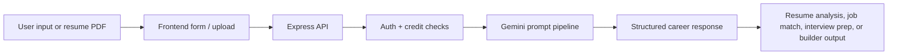
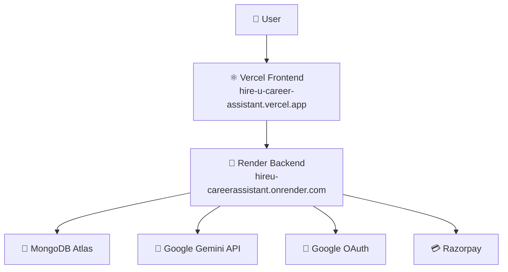

<div align="center">

# 📚 HireU - Career Assistant

AI-powered career preparation for resumes, job matching, interview practice, and resume building.

[](https://hire-u-career-assistant.vercel.app)
[](https://hireu-careerassistant.onrender.com)
[](https://react.dev)
[](https://www.typescriptlang.org)
[](https://www.mongodb.com/atlas)

**Live App:** [hire-u-career-assistant.vercel.app](https://hire-u-career-assistant.vercel.app)  
**Backend API:** [hireu-careerassistant.onrender.com](https://hireu-careerassistant.onrender.com)  
**Health Check:** [API /health](https://hireu-careerassistant.onrender.com/health)

</div>

---

## ✨ Overview

HireU is a full-stack AI career assistant that helps users move from resume to interview readiness in one workflow. Users can analyse their resume, match against jobs, prepare interview questions, build an improved resume, and export resume content as LaTeX.

It is built with a React/Vite frontend, an Express/TypeScript backend, MongoDB, Google OAuth, Gemini AI, and Razorpay-ready payment routes.

## 🧭 Table of Contents

- [Features](#-features)
- [Live Architecture](#-live-architecture)
- [Tech Stack](#-tech-stack)
- [Project Structure](#-project-structure)
- [Local Setup](#-local-setup)
- [Production Setup](#-production-setup)
- [API Reference](#-api-reference)
- [Deployment Checklist](#-deployment-checklist)
- [Future Improvements](#-future-improvements)

## 🚀 Features

| Feature | What it does |
| --- | --- |
| 📄 Resume Analyser | Upload a PDF resume and receive structured AI feedback. |
| 🎯 Job Matcher | Compare resume data or manual skills against suitable career roles. |
| 🎙️ Interview Prep | Generate role-specific and round-specific interview questions. |
| 🧱 Resume Builder | Build, improve, export, and download a polished resume. |
| 🧾 LaTeX Export | Generate editable LaTeX resume output for Overleaf or local compilation. |
| 🔐 Google OAuth | Sign in securely using Google authentication. |
| 🪙 Credits + Payments | Credit tracking, subscription fields, and Razorpay payment routes are wired. |

<details>
<summary><strong>🧠 AI workflow</strong></summary>



</details>

## 🏗️ Live Architecture



## 🛠️ Tech Stack

| Layer | Technology |
| --- | --- |
| Frontend | React 19, TypeScript, Vite 8, Tailwind CSS v4 |
| Routing | React Router v7 |
| API Client | Axios |
| Auth | Google OAuth, JWT |
| Backend | Node.js, Express 5, TypeScript |
| Database | MongoDB, Mongoose |
| AI | Google Gemini via `@google/genai` |
| Payments | Razorpay |
| Deployment | Vercel frontend, Render backend |

## 📁 Project Structure

```text
aicareer/
|-- backend/
|   |-- src/
|   |   |-- config/
|   |   |-- controllers/
|   |   |-- middlewares/
|   |   |-- models/
|   |   |-- routes/
|   |   |-- services/
|   |   `-- index.ts
|   |-- .env.example
|   |-- package.json
|   `-- tsconfig.json
|-- frontend/
|   |-- src/
|   |   |-- components/
|   |   |-- context/
|   |   |-- pages/
|   |   |-- App.tsx
|   |   `-- main.tsx
|   |-- public/
|   |-- .env.example
|   |-- vercel.json
|   |-- package.json
|   `-- vite.config.ts
|-- render.yaml
`-- README.md
```

## ⚙️ Local Setup

### Prerequisites

- Node.js 20 recommended
- MongoDB URI from MongoDB Atlas or a local MongoDB instance
- Google Cloud OAuth 2.0 client ID and client secret
- Gemini API key from Google AI Studio
- Razorpay key ID and secret if testing payments

<details open>
<summary><strong>Backend setup</strong></summary>

```bash
cd backend
cp .env.example .env
npm install
npm run dev
```

`backend/.env`

```env
PORT=5000
FRONTEND_URL=http://localhost:5173
MONGO_URI=your_mongodb_connection_string
GOOGLE_CLIENT_ID=your_google_client_id
GOOGLE_CLIENT_SECRET=your_google_client_secret
API_KEY_GEMINI=your_gemini_api_key
JWT_SEC=your_long_random_jwt_secret
RAZORPAY_KEY_ID=your_razorpay_key_id
RAZORPAY_KEY_SECRET=your_razorpay_key_secret
```

Backend runs at `http://localhost:5000`.

</details>

<details open>
<summary><strong>Frontend setup</strong></summary>

```bash
cd frontend
cp .env.example .env
npm install
npm run dev
```

`frontend/.env`

```env
VITE_API_URL=http://localhost:5000
VITE_GOOGLE_CLIENT_ID=your_google_client_id
```

Frontend runs at `http://localhost:5173`.

</details>

## 🌐 Production Setup

### Render Backend

Required Render environment variables:

```env
FRONTEND_URL=https://hire-u-career-assistant.vercel.app
MONGO_URI=your_mongodb_connection_string
GOOGLE_CLIENT_ID=your_google_client_id
GOOGLE_CLIENT_SECRET=your_google_client_secret
API_KEY_GEMINI=your_gemini_api_key
JWT_SEC=your_long_random_jwt_secret
RAZORPAY_KEY_ID=your_razorpay_key_id
RAZORPAY_KEY_SECRET=your_razorpay_key_secret
```

Render settings:

```text
Build Command: npm ci && npm run build
Start Command: npm start
Health Check Path: /health
```

### Vercel Frontend

Required Vercel environment variables:

```env
VITE_API_URL=https://hireu-careerassistant.onrender.com
VITE_GOOGLE_CLIENT_ID=your_google_client_id
```

Vercel settings:

```text
Root Directory: frontend
Framework Preset: Vite
Build Command: npm run build
Output Directory: dist
Install Command: npm ci
```

### Google OAuth

Add these Authorized JavaScript origins in Google Cloud Console:

```text
http://localhost:5173
https://hire-u-career-assistant.vercel.app
```

The current flow uses `postmessage`, so no redirect URI is required unless the OAuth implementation changes later.

## 📡 API Reference

| Method | Route | Description | Auth |
| --- | --- | --- | --- |
| GET | `/` | API status | No |
| GET | `/health` | Render health check | No |
| POST | `/api/user/login` | Google OAuth login | No |
| GET | `/api/user/me` | Current user profile | Yes |
| GET | `/api/user/history` | User history | Yes |
| GET | `/api/review` | List reviews | No |
| POST | `/api/review` | Create review | Yes |
| POST | `/api/ai/analyse` | Resume analysis | Yes |
| POST | `/api/ai/jobmatcher` | Job matching | Yes |
| POST | `/api/ai/interview` | Interview question generation | Yes |
| POST | `/api/ai/buildresume` | Resume builder and improver | Yes |
| POST | `/api/ai/generate-latex` | LaTeX resume generation | Yes |
| POST | `/api/payment/checkout` | Razorpay order creation | Yes |
| POST | `/api/payment/verify` | Razorpay payment verification | Yes |
| GET | `/api/payment/status` | Credit and subscription status | Yes |

Protected routes require:

```text
Authorization: Bearer <token>
```

## ✅ Deployment Checklist

- [x] Frontend deployed on Vercel
- [x] Backend deployed on Render
- [x] Backend health route available at `/health`
- [x] Frontend points to production API through `VITE_API_URL`
- [x] Backend allows the Vercel origin through `FRONTEND_URL`
- [ ] MongoDB Atlas production access configured
- [ ] Gemini production key configured
- [ ] Google OAuth production origin configured
- [ ] Razorpay live keys configured when payments go live

## 🧪 Build Commands

```bash
# Backend
cd backend
npm run build
npm start

# Frontend
cd frontend
npm run build
npm run preview
```

## 🗺️ Future Improvements

- Add screenshots and a short demo GIF.
- Add automated API tests for protected AI routes.
- Add rate limiting and stricter production CORS monitoring.
- Add richer subscription and billing history UI.
- Add CI checks for frontend and backend builds.

## 📝 Notes

- Render free instances may spin down after inactivity, so the first request after a cold start can be slower.
- `frontend/vercel.json` rewrites frontend routes to `index.html`, keeping React Router refresh-safe.
- Never commit real `.env` files or production secrets.

---

<div align="center">

Built with focus by [Krish Prasad](https://github.com/Krish-Prasad09)  
⭐ Star the repo if HireU helps you ship better career tools.

</div>
